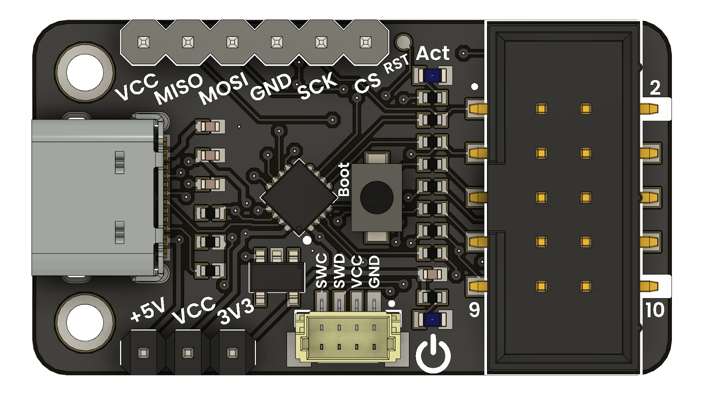
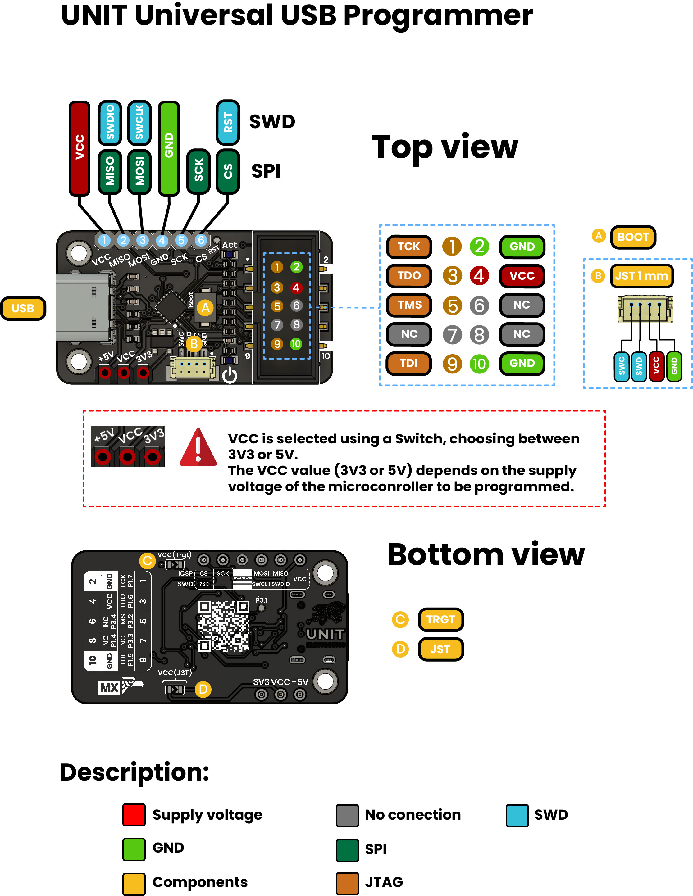
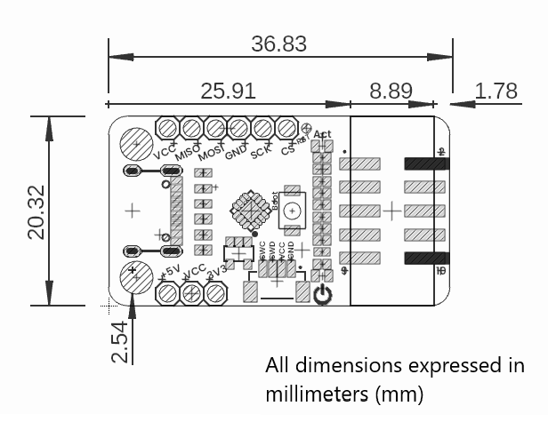

<!--
# README_TEMPLATE.md
Este archivo sirve como entrada para generar un PDF técnico estilo datasheet.
Edita las secciones respetando el orden, sin eliminar los encabezados.
-->
 <!-- logo -->

# CH552 USB Multi-Protocol Programmer 

## Introduction

The CH552 USB Multi-Protocol Programmer is a compact and versatile USB programming tool powered by the WCH CH552 microcontroller. Designed for developers, educators, and hobbyists, it supports programming and debugging across three key domains: AVR microcontrollers, ARM Cortex-M processors, and Intel/Altera CPLDs.

With multiple firmware profiles, this device can seamlessly switch between USBasp, CMSIS-DAP, and USB-Blaster compatible JTAG modes. Its hardware voltage selector ensures compatibility with target boards operating at 3.3V or 5V. The built-in USB bootloader simplifies firmware flashing, and compatibility with tools like `avrdude`, `OpenOCD`, and Quartus Programmer makes it an ideal choice for embedded development in diverse environments.

## Functional Description

- USB Full-Speed interface (CDC or HID, depending on firmware)
- Programmable firmware profiles: AVR, CMSIS-DAP, and CPLD
- CH552G / CH552E microcontroller
- Selectable target voltage: 3.3V or 5V
- Bootloader mode for firmware flashing

## Electrical Characteristics & Signal Overview

- The target voltage can be toggled between 3.3V and 5V using a physical switch.
- Programming interfaces include JTAG (TCK, TMS, TDI, TDO, nTRST) via a 2x5 1.27mm header, SWD (SWDIO, SWCLK) via a standard or JST connector, and SPI (MISO, MOSI, SCK, CS) via an inline header.
- A dedicated JST 1.0mm connector provides SWDIO, SWCLK, VCC, and GND for quick connections.

## Applications

- AVR programming via USBasp and UPDI
- ARM Cortex-M debugging via CMSIS-DAP (OpenOCD, PyOCD)
- JTAG programming for Intel/Altera MAX II CPLDs
- Universal compact programmer for educational kits
- Embedded development and prototyping

## Features

- Multiple firmware modes: AVR, ARM CMSIS-DAP, CPLD JTAG
- Standard USB HID/CDC communication
- Compatible with major programming tools (avrdude, OpenOCD, Quartus)
- Small footprint, easy to integrate into projects
- SDCC-compatible source code
- Support for Linux, and macOS

## Pin & Connector Layout

| Color     | Signal Type              | Description                          |
| --------- | ------------------------ | ------------------------------------ |
| Red       | Power                    | Supply voltage (VCC)                 |
| Green     | Ground                   | Common ground (GND)                  |
| Blue      | SWD                      | SWDIO and SWCLK signals              |
| Teal      | SPI                      | SPI interface signals                |
| Orange    | JTAG                     | JTAG interface signals               |
| Gray      | Not Connected            | Unused or reserved lines             |
| Color     | Signal Type              | Description                          |

## Settings

### Interface Overview

| Interface  | Signals / Pins            | Typical Use                                         |
|------------|----------------------------|-----------------------------------------------------|
| JTAG       | TCK, TMS, TDI, TDO, nTRST  | Full chip programming, in-circuit test, debug       |
| SPI        | MOSI, MISO, SCK, CS        | Flash memory programming, peripheral data exchange  |
| SWD        | SWCLK, SWDIO               | Cortex-M programming and debugging                  |
| JST Header | SWCLK, SWDIO, VCC, GND     | Quick-connect to target board for SWD and power     |

###  Supports 

| Symbol | I/O   | Description                         |
| ------ | ----- | ----------------------------------- |
| VCC    | Input | Power supply (3.3V or 5V)           |
| GND    | -     | Ground                              |
| BOOT   | Input | Enter bootloader mode               |
| P3.0   | I/O   | General purpose (protocol-specific) |
| P3.1   | I/O   | General purpose (protocol-specific) |
| P3.2   | Input | BOOT button                         |

### Firmware Modes: AVR Programmer

| Feature         | Description                    |
| --------------- | ------------------------------ |
| Protocols       | USBasp, Serial UPDI            |
| Targets         | ATmega, ATtiny, other AVR MCUs |
| Tools Supported | avrdude, PlatformIO            |
| USB Mode        | HID (USBasp), CDC (UPDI)       |
| Voltage Output  | 3.3V / 5V selectable           |

### Firmware Modes: CMSIS-DAP Debugger

| Feature         | Description                             |
| --------------- | --------------------------------------- |
| Protocols       | SWD, JTAG (CMSIS-DAP v1)                |
| Targets         | ARM Cortex-M (STM32, nRF52, SAMD, etc.) |
| Tools Supported | OpenOCD, PyOCD, Keil µVision, SEGGER    |
| USB Mode        | HID + optional CDC UART                 |
| Drivers         | Native (Linux/macOS)                    |

### Firmware Modes: CPLD Programmer

| Feature         | Description                                    |
| --------------- | ---------------------------------------------- |
| Protocol        | JTAG via USB-Blaster emulation                 |
| Targets         | Intel/Altera MAX II (e.g., EPM240)             |
| Tools Supported | Quartus Programmer                             |
| USB VID/PID     | Safe: 0x16C0:0x05DC, Compatible: 0x09FB:0x6001 |
| Voltage Output  | 3.3V / 5V selectable                     

## Block Diagram

## Dimensions

## Usage

Works with:

- Arduino AVR
- Raspberry Pi RP2040
- STM32
- NRF
- PY32
- MAX II 

## Downloads

- [Schematic PDF](docs/schematic.pdf)
- [MAX1704X Library](https://github.com/UNIT-Electronics/MAX1704X_lib)

## Purchase

- [Buy from UNIT Electronics](https://www.uelectronics.com)
